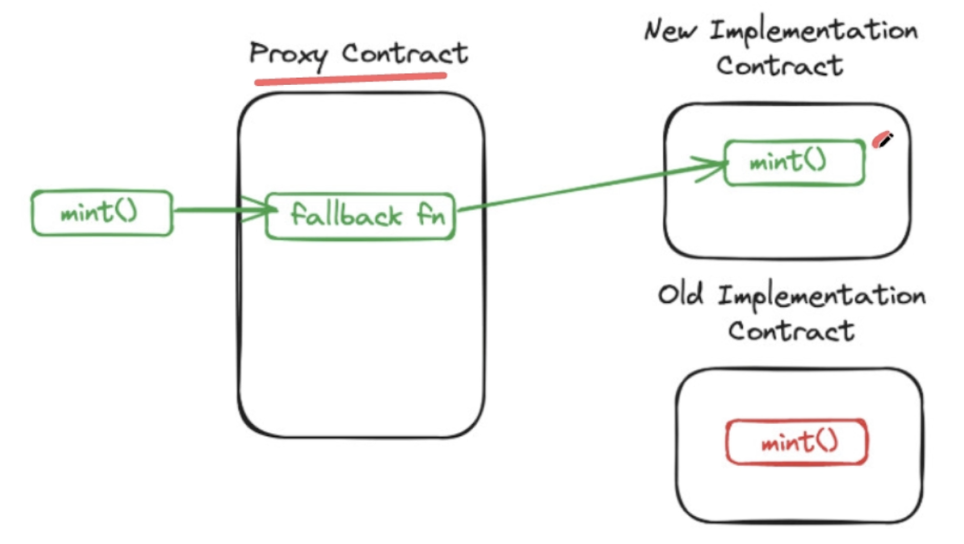
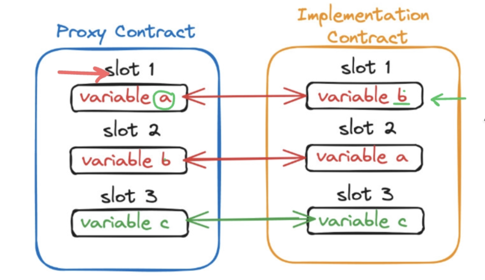
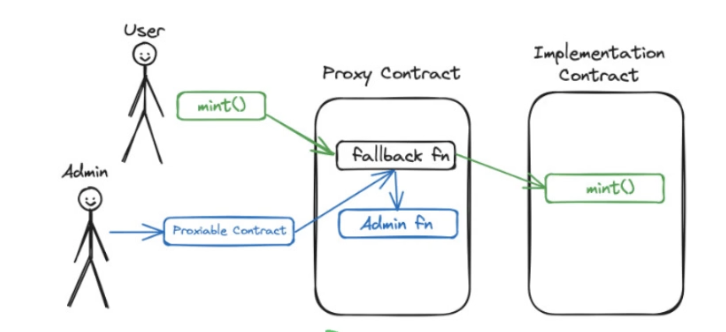
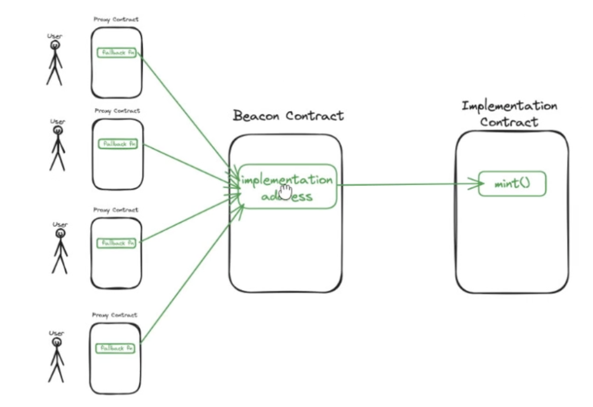

# Upgradeability patterns

This guide introduces the main upgradeability patterns in smart contracts — **Transparent Proxy Pattern, UUPS, and Beacon Pattern** — outlining their core mechanisms, advantages, and risks to help you understand how each approach enables safe and flexible contract upgrades.

## What are upgradeability patterns?

Smart contracts are immutable by default. Once a contract is deployed to the blockchain, its code cannot be changed. This property ensures security and trust, but it also creates an important limitation:
if a bug appears or the protocol needs to evolve, the deployed contract cannot be modified.

**Upgradeability patterns** solve this limitation by introducing an architecture that separates storage from logic.
Instead of having variables and functions inside a single immutable contract, we split responsibilities into two components:

- **Proxy Contract** — stores all the state variables and receives user interactions.
- **Implementation Contract** — contains the logic and functions that modify the proxy’s state.

The key idea is that the Proxy Contract never changes once deployed.
What can change is the address of the Implementation Contract it points to.
By updating this reference, the protocol can introduce new functionality, fix bugs, or expand its features — all while preserving user funds and storage.

This design makes the system upgradeable, extensible, and aligned with real-world needs where protocols evolve over time.

## Proxy Pattern

The Proxy Pattern is the mechanism that makes upgradeable smart contracts possible.
Instead of running the logic directly, the Proxy Contract uses Solidity’s low-level instruction `delegatecall` to forward user calls to an external Implementation Contract. The key property is that the logic is executed, but all state changes remain stored inside the Proxy.

`delegatecall` connects both contracts, allowing the logic to run as if it belonged to the Proxy.

Because `delegatecall` operates over the Proxy’s storage, both contracts must maintain the same variable order and structure. The Proxy defines how storage slots are arranged, and every implementation must follow this layout to avoid storage collisions.
A **storage collision** occurs when the Proxy expects variable A to be stored in slot A, but the Implementation Contract defines a different variable (variable B) in that same slot. As a result, when the protocol believes it is writing to variable A, it is actually overwriting variable B — corrupting the contract’s state.

## Transparent Proxy Pattern

The Transparent Proxy Pattern builds on the standard Proxy approach but introduces an access-control distinction between regular users and the admin (or deployer).

- When a user interacts with the Proxy, the contract forwards the call through delegatecall to the Implementation Contract, exactly as in the basic Proxy Pattern.
- When the admin interacts with the Proxy, the call is not delegated. Instead, the Proxy exposes its own internal functions that allow upgrading the implementation.

✅​ **Pros**

- Implementation can always be upgraded through the Proxy.
- Clear separation between admin operations and user logic.

❌​ **Cons**

- Higher gas and deployment costs.
- The admin cannot interact with the protocol as a regular user.

## UUPS Pattern (Universal Upgrade Proxy Standard)

With the UUPS Pattern the upgrade logic is implemented directly inside the Implementation Contract rather than inside the Proxy.
User interactions are forwarded through delegatecall, and the Proxy holds all the storage.
The difference is that the Implementation Contract itself contains the `upgradeTo()` function inherited from OpenZeppelin's `UUPSUpgradeable` component , which is responsible for updating the implementation address.
With this design, the admin can interact with the protocol as a normal user because all calls pass through the Proxy and reach the Implementation via delegatecall.

✅​ **Pros**

- The admin can interact with the protocol like any other user.
- Simpler Proxy and potentially more gas-efficient upgrades.
- Upgrade logic is modular and contained within the implementation.

❌​ **Cons**

- Forgetting to inherit from the upgradeable base contract results in a non-upgradeable implementation.

## Beacon Proxy Pattern

The Beacon Proxy Pattern introduces a third component called the **Beacon Contract**, which stores the address of the current Implementation Contract.
Multiple Proxy Contracts can be configured to read the implementation address from the Beacon.
This allows upgrading many Proxy instances at once simply by updating the implementation address stored in the Beacon.

Each Proxy still uses `delegatecall` to execute the logic, but the pointer to that logic is retrieved from the Beacon instead of being stored in the Proxy itself.

This pattern is especially useful for systems that deploy many similar contracts, such as tokenized assets, factory-created ERC721s, or repeated protocol instances, where a single upgrade operation should apply to all of them simultaneously.

✅​ **Pros**

- Highly efficient when upgrading multiple Proxy Contracts at the same time.
- Reduces operational overhead by requiring only one upgrade transaction.

❌ **Cons**

- Introduces an additional layer that can act as a centralized point of failure.
- More complex architecture that requires careful security review.

## Resources

- [Upgradeability in Smart Contracts](https://scsfg.io/developers/upgradeability/)
- [Smart contract proxy utilities and implementations (OZ)](https://docs.openzeppelin.com/contracts/4.x/api/proxy)
- [Transparent Proxy Pattern (OZ)](https://docs.openzeppelin.com/contracts/4.x/api/proxy)
- [UUPS Pattern (EIP-1822)](https://eips.ethereum.org/EIPS/eip-1822)
- [UUPS Pattern (OZ)](https://docs.openzeppelin.com/contracts-stylus/uups-proxy)
- [Beacon Pattern (OZ)](https://docs.openzeppelin.com/contracts/4.x/api/proxy#BeaconProxy)
- [Diamond Pattern (EIP-2535)](https://eips.ethereum.org/EIPS/eip-2535)
